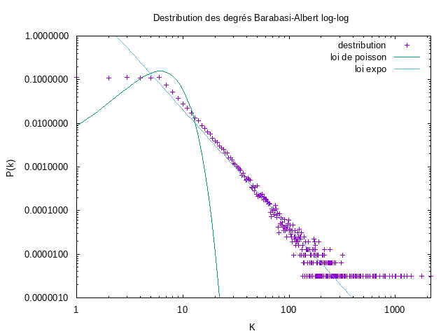

# MesuresDeRéseauDInteraction

Apres avoir télécharger le fichier des données , on a utilisé GraphStream pour lire ces données .
**Question 2** :
Pour cette question on utilise des fonctions de la classe **Toolkit**
- **Nombre de noeuds**

Pour calculer le nombre de noeuds on utilise la fonction getNodeCount() .  
Le nombre de noeuds du graphe est  : **317080**

- **le degré moyen**
pour calculer le degré moyen on utilise la méthode averageDegree(graph). 
Le degré moyen du graphe est : **6.62208890914917**

- **Coefficient de clustering**
on utilise la methode averageClusteringCoefficient(graph) . 
Le coefficient de clustering :**0.6324308280637396**

- **Coefficient de clustering pour un reseau aleatoire**
Le coefficient de clustering d'un réseau quelconque est le degré moyen `<K>` / le nombre de noeuds `N`.  
pour un graphe de même degré et de même taille , le coefficient de clustering est  : **2.0884599814397534E-5**

**Question 3** :

1- Un réseau connex est un réseau dont à partir d'un sommet on peut visiter n'importe quel autre sommet du réseau .
une méthode de la bibliothéque ToolKit nous permet de savoir si un graphe est connex ou pas , c'est la méthode isConnected(graph) .
2- Pour q'un réseau aleatoire soit connex , il faut vérifier que le degré moyen `<K>` est superieur au Ln(nombre de noeud du graphe `N`) , c'est-à-dire `<k> > ln(N)` . 
Donc pour un réseau aléatoire de même taille et même degré (ce qui fait `<k> = 6.62208890914917 ` et `
ln(N) = 12.666909387`) , on constate que `〈k〉< ln(N)` , donc le réseau n'est pas connex .

Un réseau aleatoire de même taille est connex si seulement si le degré moyen de ce réseau est superieur à 12.666909387.

**Question 4** :
La destribution des degrés est la probabilité qu'un noeud ait le degré `K`  
Pour calculer la destribution des degrés , on fait appel a la fonction degreeDistribution(graph) de ToolKit , cette fonction renvoie un tabelau tel que l'indice du tableau represente le degré et sa valeur est le nombre de noeuds ayant ce degré.  
On stocke les resulats obtenus dans un fichier ***"destDEG.dat"*** ,  qu'on va utiliser pour tracer les graphes avec `gnuplot` .

- Graphe des destributions en echelle linéaire :
- Graphe des destributions en echelle log-log 

on observe une ligne droite en analysant le graphe en echelle log-log , cela signifie que la distribution de degré suit une loi de puissance.

**Question 5** :
La distance moyenne d'un graphe est la somme des distances entre un noeud source et tous les autres noeuds du graphe .
Comme notre graphe est trés grand , on prend un echantillon de 1000 noeuds au hasard , et on calcule la somme des distances vers les autres noeuds . 
La disatance moyenne calculée avec 1000 noeuds au hasard est : **6.8094198435726** . 
D'aprés le resulat obtenu , l'hypothése de six degrés de séparation est confirmée .  
Pour savoir si c'est un réseau `petit monde` if faut vérifier que `<d> = d_max = ln(N) / ln<k>` .  
 `<d>` = 6.8094198435726 .  
`d_max = ln(317080) / ln (6,6220889) ` = 6.70061182375  
Les deux valeurs de `<d>` et ` d_max` sont pas égaux , mais comme notre méthode ne permet pas d'avoir des resulats avec une grande précision , on peut dire que le réseau est un petot monde .  
La distance moyenne dans un réseau aléatoire avec les mêmes caractéristiques est **6.700611818856679 ≈ d_max** .   

Le graphe des distribution des distances resultant est le suivant  :

L'hypothése qu'on peut formuler sur ce type de distribution c'est qu'elle suit **la loi Binomiale**

**Question 6** :
Pour générer un réseau avec la méthode d'attachement préférentiel (Barabasi-Albert) , on utilise un générateur dans GraphStream appelé **BarabasiAlbertGenerator(degré)** avec le degré maximum d'un noeud en paramètre .
***Les resultats***
- Nombre de noeuds d'un réseau Barabasi-Albert  : **317080**
- Degré moyen d'un réseau Barabasi-Albert : **6.998549461364746**
- Le coefficient de clustering d'un réseau Barabasi-Albert :**4.156591383224424E-4**
- Le graphe est-il connex  => Oui .

**Les graphes resultants avec le modèle Barabasi-Albert**

**Conclusion**

- Les résultats expérimentaux correspondent-ils aux prédictions théorique ? =>  Vrai
- On remarque que les modèles théoriques de génération sont assez proches de la réalité concernant les degrés et distances, mais restent très loin du compte en termes de clustering.
- Un reseau Barabasi-Albert est connex contrairement a un reseau aleatoire .

# Propagation dans des réseaux

**Question 1**
- Le taux de propagation d'un virus :  
Le taux de propagation du virus `λ`  est la propabilité de transmission dans une unité de temps `β` / la propabilité de redevenir suseptible `µ` 
*** `λ  = β / µ `*** 
 Comme un individu envoie en moyenne un mail par semaine donc `β = 1/7 ` , et un individu met à jour son anti-virus en moyenne deux fois par mois donc `µ = 1/14 ` =>
`λ` = (1/7) / (1/14) = 2  

- Le seuil épidémique `λc` 
Le seuil épidémique `λc = <k>/<k²>` , tel que `⟨k⟩=6.622` et `<k²>= 144,631 ` => `λc = 0.046`

- Le seuil d'un réseau aléatoire du même degré moyen `λc= 1/k+1 ` = 0.131

**Question 2:**

***_Scenario 1_***

On remarque que la propagation du virus augmente d'une manière très importante les 30 premiers jours pour attendre les environs de 280000 cas d'infections , ensuite la courbe se stabilise jusqu'à la fin de l'expérience .  

***_Scenario 2_***

Le second scénario consiste è immuniser aléatoirement 50% de la population , et donc ils ne peuvent pas être infectés par le virus  .
Comme dans le premier cas un patient zero est choisi aléatoirement du côté des noeuds non-immunisés , on remarque que le virus commence à se propager dès le 15 ème jour pour infecter pour attendre environ 100000 noeuds et ensuite il se stabilise jusqu'à la fin de l'expérience .

***_Scenario 3_***

Comme on peut le voir, le nombre d'infectés est négligeable par rapport aux deux autres scénarios avec un maximum de 4 infectés pendant la période de l'expérience .

- Le degré moyen du groupe 0 est : 6.640904503595308
- Le degré moyen du groupe 1 est : 18.532553298852026

La différence des degrés moyens est dû nombre élevé de voisin et donc une probabilité élevée d'être immunisés.
**Graphe comparant les 3 scénarios**

**Question 4**
- Le seuil épidémique du scénario 2 est : 0.086
- Le seuil épidémique du scénario 3 est : 0.045

Le seuil épidémique du scénario 2 est deux fois plus grand que celui du réseau initial  , tandis que le seuil épidémique du scénario 3 (immunisation selective) est presque égale au scénario initial    